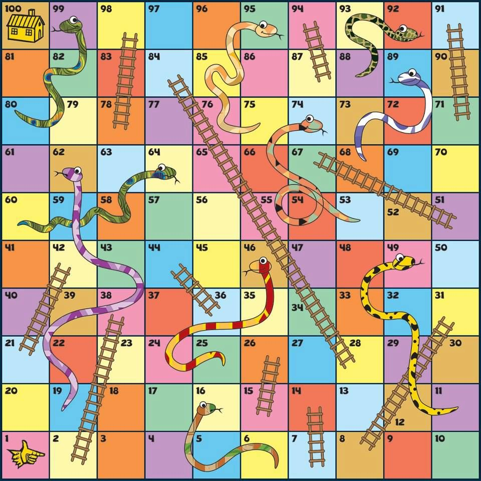

# cpp-snake

This is a simple snake & ladders simulation using OOP in cpp.




## Instructions

You can find the instructions for this activity [here](./assets/TC1030-t1-POO.pdf)

## Compiling

To compile the project, run:

```bash
g++ src/main.cpp -o bin/main
```

## Running

To run the project, first compile it, and then run:

```bash
bin/main
```
